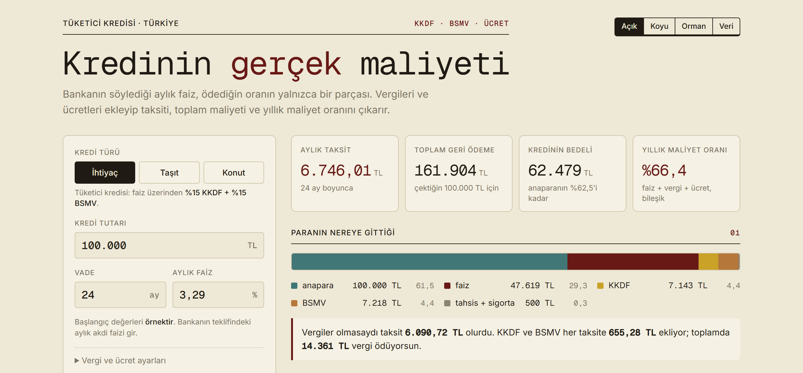
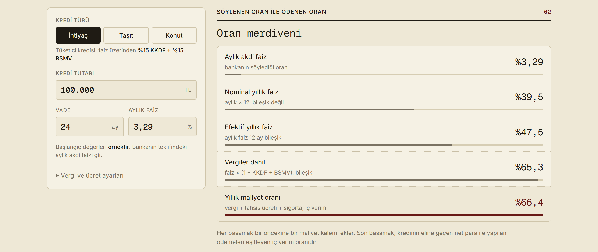
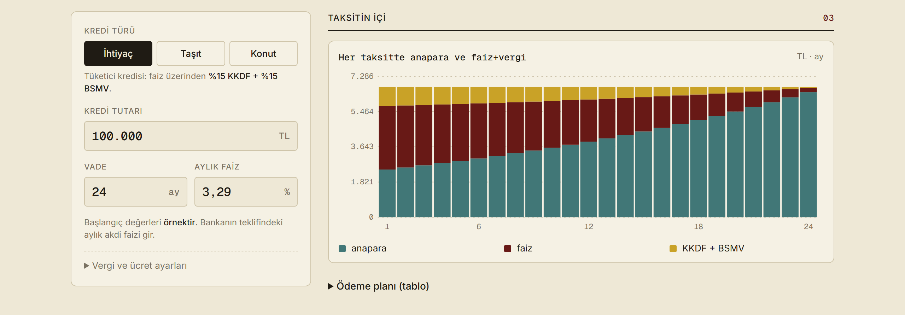

# Kredinin gerçek maliyeti

Bankanın söylediği aylık faiz, ödediğin oranın yalnızca bir parçası. Bu sayfa KKDF, BSMV ve tahsis ücretini ekleyip taksiti, toplam maliyeti ve yıllık maliyet oranını çıkarır.

**[Siteyi aç → mcemdemirkol.github.io/kredinin-gercek-maliyeti](https://mcemdemirkol.github.io/kredinin-gercek-maliyeti/)**

[](https://mcemdemirkol.github.io/kredinin-gercek-maliyeti/)

## Ne

Tek dosyalık bir hesaplayıcı. Kredi türü, tutar, vade ve aylık faiz girilir; sayfa şunları gösterir:

- aylık taksit, toplam geri ödeme ve kredinin bedeli,
- ödenen paranın anapara, faiz, KKDF, BSMV ve ücret olarak dağılımı,
- söylenen orandan gerçekten ödenen orana giden basamaklar,
- her taksitin içindeki anapara, faiz ve vergi payı ile ödeme planı tablosu.

Kurulum ve sunucu gerekmez; hesap tarayıcıda yapılır.

## Söylenen oran ile ödenen oran

Aylık %3,29 faiz, yıllık %39,5 gibi okunur. Bileşik hesaplanınca %47,5, vergiler eklenince %65,3, tahsis ücretiyle birlikte %66,4 olur.



## Taksitin içi

İlk taksitlerin büyük kısmı faiz ve vergidir; anapara payı vade ilerledikçe büyür.



## Hesap

```
i   = aylık akdi faiz
i*  = i · (1 + KKDF + BSMV)            vergiler faize eklenir
A   = P · i* / (1 − (1 + i*)^(−n))     eşit taksit

her ay:  faiz_k    = kalan · i
         vergi_k   = faiz_k · (KKDF + BSMV)
         anapara_k = A − faiz_k − vergi_k

net ele geçen        = P − tahsis · (1 + BSMV) − sigorta
net ele geçen        = Σ A / (1 + r)^k      →  r (aylık iç verim)
yıllık maliyet oranı = (1 + r)^12 − 1
```

## Doğrulama

`dogrulama/hesap.py` aynı formülleri Python'da sıfırdan uygular. Dört senaryoda sayfanın gösterdiği değerlerle aynı sonucu verir:

| Senaryo | Taksit | Toplam geri ödeme | Yıllık maliyet oranı |
|---|---|---|---|
| İhtiyaç · 100.000 TL · 24 ay · %3,29 | 6.746,01 TL | 161.904 TL | %66,4 |
| İhtiyaç · 250.000 TL · 36 ay · %4,50 · 1.500 TL sigorta | 16.794,14 TL | 604.589 TL | %100,0 |
| Konut · 2.000.000 TL · 120 ay · %2,79 | 57.932,14 TL | 6.951.857 TL | %39,4 |
| İhtiyaç · 50.000 TL · 1 ay · %0 | 50.000,00 TL | 50.000 TL | %7,2 |

```bash
python dogrulama/hesap.py
```

Ek paket gerekmez.

## Oranlar ve kaynaklar

Son kontrol: 4 Ekim 2026.

- **KKDF %15** (tüketici kredileri). Temmuz 2025'teki 10094 sayılı Karar yalnızca ticari döviz ve altın kredilerini değiştirdi. [Kaynak](https://kpmgvergi.com/yayinlar/mali-bultenler/vergi/doviz-ve-altin-kredilerde-kkdf-oranini-degistiren-1772025-tarihli-ve-10094-sayili-cumhurbaskani-karari-1872025-tarihli-resmi-gazetede-yayimlandi/3139)
- **BSMV %15** (tüketici kredileri, 7 Temmuz 2023'ten beri; 7345 sayılı Karar). [Kaynak](https://www.alomaliye.com/2023/07/07/6802-sayili-banka-ve-sigorta-muameleleri-vergisi-karar-sayisi-7345/)
- **Konut kredileri** KKDF ve BSMV'den muaf.
- **Tahsis ücreti** anaparanın binde 5'ini geçemez; sayfada üst sınır varsayılır ve üzerine BSMV eklenir.

Oranlar sayfadaki "Vergi ve ücret ayarları" bölümünden değiştirilebilir.

## Yayın

Site `gh-pages` dalından yayınlanır; bu dal `main` ile aynıdır. Değişiklikten sonra:

```bash
git push origin main:gh-pages
```

## Sınırlar

- Yalnız eşit taksitli, sabit faizli kredi. Ara ödeme, erken kapama ve değişken faiz yok.
- Sigorta tek seferlik tutar olarak girilir; ekspertiz, rehin ve benzeri masraflar ayrıca modellenmedi.
- Başlangıçtaki faiz oranı örnektir, güncel piyasa oranı değildir.
- Bilgilendirme amaçlıdır, finansal tavsiye değildir. Bağlayıcı olan bankanın sözleşmesidir.

## Aynı seriden

[Bir kredi notu nasıl hesaplanır?](https://github.com/mcemdemirkol/kredi-notu-nasil-hesaplanir) — gerçek bir veri setinde baştan sona kredi skorkartı.

## English summary

A single-file calculator for the true cost of a consumer loan in Türkiye: it adds the KKDF and BSMV taxes and the origination fee to the quoted monthly rate and reports the instalment, total cost, payment breakdown and the annual cost rate (IRR). `dogrulama/hesap.py` is an independent Python implementation that reproduces the page's numbers.
